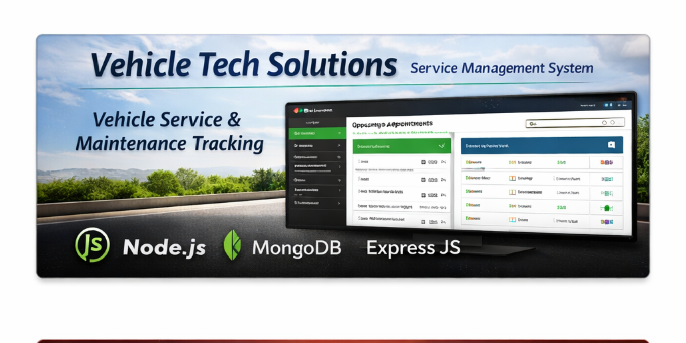
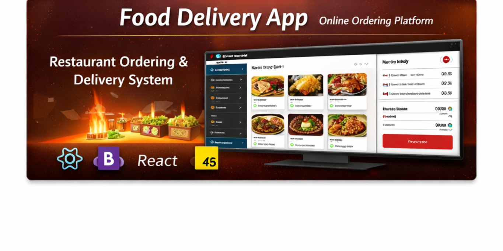

<!-- ===================== -->
<!--        BANNER        -->
<!-- ===================== -->

<!-- ===================== -->
<!--     INTRO SECTION    -->
<!-- ===================== -->
<table width="100%">
<tr>

<td width="65%" valign="top">

# 👋 Hi, I'm Deepak Ranjan Rath  
### 💻 Software Developer | Full Stack Learner | ML Enthusiast  
I am a passionate **Software Developer** with hands-on experience in  
**Java, JavaScript, React, MongoDB, and Machine Learning**.  
I enjoy building real-world projects and continuously improving my  
**problem-solving and backend skills**.

---

## 🚀 About Me
- 🎓 MCA Graduate (**GIFT Autonomous, Bhubaneswar**)
- 🎓 BSc Physics (**Utkal University, Bhubaneswar**)
- 💼 Former Intern at **Moovon Service & Solutions Pvt. Ltd.**
- 🌱 Currently learning **Backend Development & System Design**
- 🔥 Interested in **React, Node.js, MongoDB & AI**
- 💡 Love building scalable and clean applications
- 🧠 Strong foundation in Data Structures, Algorithms & OOP concepts

⚙️ Hands-on experience building RESTful APIs and full-stack applications

🧪 Worked on Machine Learning projects including sentiment analysis & prediction models

🧩 Comfortable with problem-solving, debugging, and code optimization

🛠 Experience using Git & GitHub for version control and collaboration

📦 Familiar with MongoDB Compass and database design principles

🎯 Passionate about writing clean, maintainable, and scalable code

🚀 Experience developing real-world projects from idea to deployment

🧑‍💻 Actively practicing JavaScript & React for modern web development

🔐 Basic understanding of authentication, authorization & security concepts

📊 Exposure to Power BI & data visualization fundamentals

🤝 Comfortable working in team environments and Agile workflows

📚 Continuous learner who enjoys exploring new technologies and frameworks

🧑‍🏫 Able to understand requirements and convert them into technical solutions

🌐 Interested in cloud concepts and backend scalability

</td>

<td width="35%" valign="top" align="center">

  

### 📍 Location  
Bhubaneswar, Odisha, India  

 

### 🎯 Focus Areas  
Backend Development  
System Design  
Clean Code  

 

### ⚡ Motto  
*Build. Learn. Improve.*

  

</td>

</tr>
</table>

---

## 👀 Profile Views

  

---

## 🛠 Tech Stack

  

---
## 🚀 Projects

---

### 🛍 Gift Mart – E-Commerce Web Application

  

- Built a full-featured **e-commerce platform** with product listing, cart, wishlist & checkout  
- Developed responsive UI using **React.js, Tailwind CSS & Bootstrap**  
- Implemented **localStorage-based cart & wishlist persistence**  
- Added **coupon system, dynamic pricing & quantity management**  

**Tech Stack:** React.js, JavaScript, Tailwind CSS, Bootstrap

---

### 🚗 Vehicle Tech Solutions – Service Management System

  

- Designed a **vehicle service & maintenance management system**  
- Implemented **service booking, tracking & customer data management**  
- Built backend logic using **CRUD operations and MongoDB**  

**Tech Stack:** Node.js, JavaScript, MongoDB, HTML, CSS

---

### 🍔 Food Delivery App – Online Ordering Platform

  

- Developed an online food ordering application with **restaurant & menu listing**  
- Implemented **cart, order summary & price calculation**  
- Designed **mobile-friendly responsive UI**  

**Tech Stack:** React.js, JavaScript, HTML, CSS, Bootstrap

---

## 🧠 Top Languages

  

---

## 📈 Contribution Graph

  

---

## ✨ Thought of the Day

  

---

## 🤝 Connect With Me

---

  

